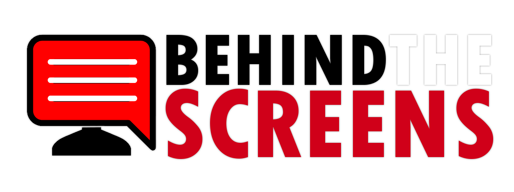

# BEHIND THE SCREENS



BSCS-3A CS-79 Undergraduate Thesis Project 2024

Behind the Screens is a web-based system that focuses on categorizing YouTube comments into sentiments to assist content creators in analyzing viewer insights. The developers of Behind the Screens are also the researchers of the study, "BEHIND THE SCREENS: A SENTIMENT ANALYSIS OF VIEWERS IN YOUTUBE LIVE STREAMS USING ROBERTA."
This thesis was successfully defended on November 26, 2024 a partial fullfilment of requirements in BS Computer Science.

- CONTENTS
  - [Scope and Limitations](#scope-and-limitations)
  - [Features](#features)
  - [Technologies](#technologies)
  - [How to Use](#how-to-use)
  - [Installation](#installation)
  - [Researchers](#researchers)

## Scope and Limitations

- Using a pre-trained model for sentiment analysis
- Categorizes comments under any YouTube videos available to the public into Positive, Negative, and Neutral
- Intended only to work with YouTube videos and not to any media platforms
- Ongoing YouTube live streams aren't considered (Live Chat)
- The model used can only analyze the English language
- It has difficulty in detecting sarcasm, inside jokes, tone of voice, slang, and non-verbal cues

## Features

- Limited analysis features on the homepage
  - Summary
  - All Comments and their respective sentiments
- User account to access all analysis features
  - Limited analysis features
  - Summary/Interpretation
  - Highlighted Comments (Positive and Negative) with Score (in percentage)
  - Bar Chart
  - 5 Frequently Used Words
  - Word Cloud
  - Previous Analyses are saved
  - PDF Download of the result

## Technologies

- Backend: Python
- Pre-trained Model for Sentiment Analysis: [RoBERTa base](https://huggingface.co/cardiffnlp/twitter-roberta-base-sentiment)
- Web Framework: Python Flask
- CSS Framework: Tailwind
- Deployment Platform during Thesis process: [Railway](https://docs.railway.com/overview/about-railway) (no longer deployed)
- YouTube Comments Extraction: [YouTubeCommentDownloader](https://pypi.org/project/youtube-comment-downloader/)
- YouTube Title Extraction: YouTube Data API v3 (previously PyTube, but it keeps having bugs)
- Text Processing: Natural Language Toolkit (NLTK)

## How to Use

1. For free access analysis, go to homepage, and click 'Analyze' at the top navigation. This will automatically lead you to the text field. To use all features, create a user account and log in.
2. Copy a YouTube URL and paste it on the text field. Click the arrow button to start the analysis and wait for the results.
3. You will be redirected to the results page.

## Installation

1. Clone the repository or download the repository’s ZIP file on Github (if there’s no copy of the repository).
2. Install the Python requirements. It is recommended to use a virtual environment.

```bash
pip install -r requirements.txt
```

3. In your terminal, start the flask application.

```bash
python main.py
```

4. Open your web browser and go to 127.0.0.1:5000

## Researchers

Everyone helped in the manuscript.

1. Project Manager, Frontend (General): [Emmanuel Gonzales](https://github.com/Kamoteng-Kahoyy)
2. Backend (All), Data Analysis, Repository Manager: [Jarelle Pamintuan](https://github.com/Isarakyun)
3. UI/UX Design, Frontend: [Ziggy Co](https://github.com/nausicai)
4. Frontend (General, mainly for User): [Joshua Casupang](https://github.com/Zeddy0621)
5. Frontend (Admin): [EJ Feliciano](https://github.com/Haya-jay)
6. Manuscript: [Nathaniel Fernandez](https://github.com/Nae8)

If you are interested to read the Thesis manuscript, please contact any of the researchers.
